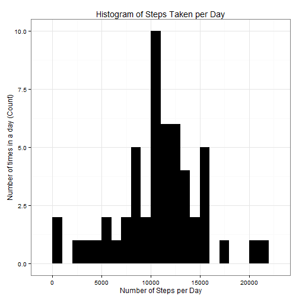
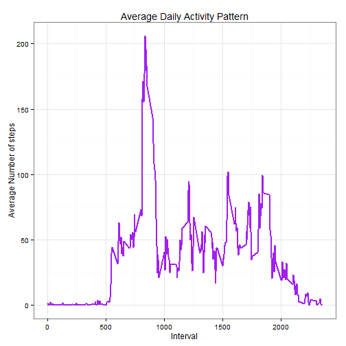
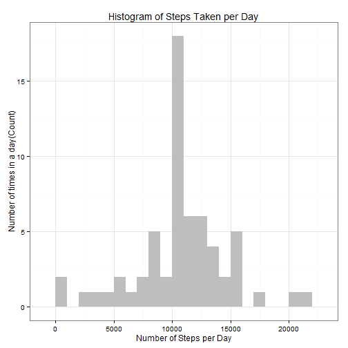
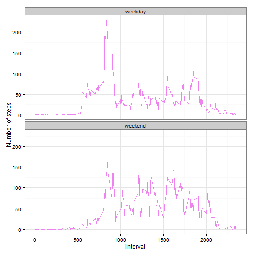

Peer Assessment 1 for Module 5 : Reproducible Research
=======================================================

## Loading and preprocessing the data
Show any code that is needed to

### 1.	Load the data (i.e. read.csv())

```r
#Load knitr library and use echo = TRUE
library(knitr)
opts_chunk$set( echo = TRUE, results = 'hold')

#Load required library
library(ggplot2)

#Load raw data file
file<-"activity.csv"#use double backslash to deal with escape caharacter
MyData<-read.csv(file,header = TRUE, sep = ",")
```

### 2.	Process/transform the data (if necessary) into a format suitable for your analysis

```r
MyData$date <- as.Date(MyData$date, format = "%Y-%m-%d")
MyData$interval <- as.factor(MyData$interval)
```

## What is mean total number of steps taken per day?
For this part of the assignment, you can ignore the missing values in the dataset.

### 1.	Calculate the total number of steps taken per day

```r
dailysum<-aggregate(steps ~ date, MyData, sum)
```

### 2.	 Make a histogram of the total number of steps taken each day

```r
dailysum<-aggregate(steps ~ date, MyData, sum)

ggplot(dailysum, aes(x = steps)) + 
       geom_histogram(fill = "black", binwidth = 1000) + 
        labs(title="Histogram of Steps Taken per Day", 
             x = "Number of Steps per Day", y = "Number of times in a day (Count)") + theme_bw() 
```

 

### 3.	Calculate and report the mean and median of the total number of steps taken per day

```r
#calculate and report mean of the total number of steps per day
dailymean<-aggregate(steps ~ date, MyData, mean)

#calculate and report median of the total number of steps per day
dailymedian<-aggregate(steps ~ date, MyData, median)
```


## What is the average daily activity pattern?
### 1.	Make a time series plot (i.e. type = "l") of the 5-minute interval (x-axis) and the average number of steps taken, averaged across all days (y-axis)

```r
steps_per_interval <- aggregate(MyData$steps, 
                                by = list(interval = MyData$interval),
                                FUN=mean, na.rm=TRUE)
#convert to integers
steps_per_interval$interval <- 
        as.integer(levels(steps_per_interval$interval)[steps_per_interval$interval])
colnames(steps_per_interval) <- c("interval", "steps")

ggplot(steps_per_interval, aes(x=interval, y=steps)) +   
        geom_line(color="purple", size=1) +  
        labs(title="Average Daily Activity Pattern", x="Interval", y="Average Number of steps") +  
        theme_bw()
```

 


### 2.	Which 5-minute interval, on average across all the days in the dataset, contains the maximum number of steps?

```r
max_interval <- steps_per_interval[which.max(steps_per_interval$steps),]
max_interval
```

```
##     interval    steps
## 104      835 206.1698
```


## Imputing missing values
Note that there are a number of days/intervals where there are missing values (coded as NA). The presence of missing days may introduce bias into some calculations or summaries of the data.

### 1.	Calculate and report the total number of missing values in the dataset (i.e. the total number of rows with NAs)

```r
sumNA2<-sum(!complete.cases(MyData))
```


### 2.	Devise a strategy for filling in all of the missing values in the dataset. The strategy does not need to be sophisticated. For example, you could use the mean/median for that day, or the mean for that 5-minute interval, etc.


```r
na_fill <- function(data, pervalue) {
        na_index <- which(is.na(data$steps))
        na_replace <- unlist(lapply(na_index, FUN=function(idx){
                interval = data[idx,]$interval
                pervalue[pervalue$interval == interval,]$steps
        }))
        fill_steps <- data$steps
        fill_steps[na_index] <- na_replace
        fill_steps
}
```

### 3.	Create a new dataset that is equal to the original dataset but with the missing data filled in.

```r
rdata_fill <- data.frame(  
        steps = na_fill(MyData, steps_per_interval),  
        date = MyData$date,  
        interval = MyData$interval)
str(rdata_fill)
#We check that are there any missing values remaining or not
sum(is.na(rdata_fill$steps))
```

```
## 'data.frame':	17568 obs. of  3 variables:
##  $ steps   : num  1.717 0.3396 0.1321 0.1509 0.0755 ...
##  $ date    : Date, format: "2012-10-01" "2012-10-01" ...
##  $ interval: Factor w/ 288 levels "0","5","10","15",..: 1 2 3 4 5 6 7 8 9 10 ...
## [1] 0
```

### 4.	Make a histogram of the total number of steps taken each day

```r
fill_steps_per_day <- aggregate(steps ~ date, rdata_fill, sum)
colnames(fill_steps_per_day) <- c("date","steps")

##plotting the histogram
ggplot(fill_steps_per_day, aes(x = steps)) + 
       geom_histogram(fill = "grey", binwidth = 1000) + 
        labs(title="Histogram of Steps Taken per Day", 
             x = "Number of Steps per Day", y = "Number of times in a day(Count)") + theme_bw() 
```

 

### Calculate and report the mean and median total number of steps taken per day. 

```r
steps_mean_fill   <- mean(fill_steps_per_day$steps, na.rm=TRUE)
steps_median_fill <- median(fill_steps_per_day$steps, na.rm=TRUE)
```

### Do these values differ from the estimates from the first part of the assignment? 


Yes, these values do differ slightly.

Before filling the data

Mean : 10766.189
Median: 10765
After filling the data

Mean : 10766.189
Median: 10766.189
We see that the values after filling the data mean and median are equal.

###What is the impact of imputing missing data on the estimates of the total daily number of steps?

It is observed that while the mean value remains unchanged, the median value  shifted and virtual matches to the mean.


## Are there differences in activity patterns between weekdays and weekends?

### 1.	Create a new factor variable in the dataset with two levels - "weekday" and "weekend" indicating whether a given date is a weekday or weekend day.

```r
weekdays_func <- function(data) {
    weekdays_steps <- aggregate(data$steps, by=list(interval = data$interval),FUN=mean, na.rm=T)
    # convert to integers for plotting
    weekdays_steps$interval <- as.integer(levels(weekdays_steps$interval)[weekdays_steps$interval])
    colnames(weekdays_steps) <- c("interval", "steps")
    weekdays_steps
}

data_by_weekdays <- function(data) {
    data$weekday <- as.factor(weekdays(data$date)) # weekdays
    weekend_data <- subset(data, weekday %in% c("Saturday","Sunday"))
    weekday_data <- subset(data, !weekday %in% c("Saturday","Sunday"))

    weekend_steps <- weekdays_func(weekend_data)
    weekday_steps <- weekdays_func(weekday_data)

    weekend_steps$dayofweek <- rep("weekend", nrow(weekend_steps))
    weekday_steps$dayofweek <- rep("weekday", nrow(weekday_steps))

    data_by_weekdays <- rbind(weekend_steps, weekday_steps)
    data_by_weekdays$dayofweek <- as.factor(data_by_weekdays$dayofweek)
    data_by_weekdays
}

data_weekdays <- data_by_weekdays(rdata_fill)
```

### 2.	Make a panel plot containing a time series plot (i.e. type = "l") of the 5-minute interval (x-axis) and the average number of steps taken, averaged across all weekday days or weekend days (y-axis). See the README file in the GitHub repository to see an example of what this plot should look like using simulated data.


```r
ggplot(data_weekdays, aes(x=interval, y=steps)) + 
        geom_line(color="violet") + 
        facet_wrap(~ dayofweek, nrow=2, ncol=1) +
        labs(x="Interval", y="Number of steps") +
        theme_bw()
```

 


